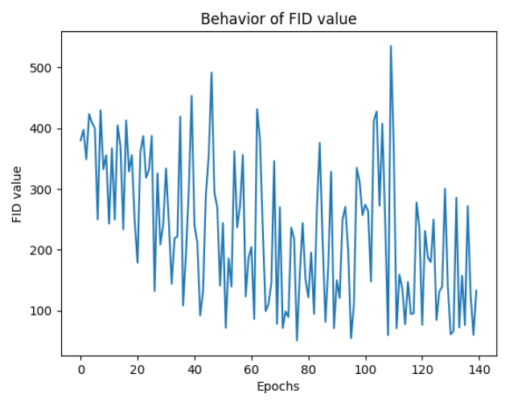

# Unpaired Neural Schrödinger Bridge

TODO: tutto da sistemare, intanto ho messo una struttura principale e sto inserendo all'interno di questo file le immagini che abbiamo fino ad ora. Poi scegliamo insieme cosa levare e cosa aggiungere. 

## Project description 

As follow is a graphical representation of the reimplemented network structure:


## Installation 

1. Clone the repository:
   ```bash
    git clone link_nostra_repo
    cd nome_cartella
    ```
2. Create and activate a virtual environment:
    ```bash
    python3 -m venv virtual 
    source virtual/bin/activate
    ```

## Training 


## Results 

<p align="center">
  
  
  
</p>

Plot of FID and KID values with 140 epochs: 

<p align="center">
  
  
</p>

